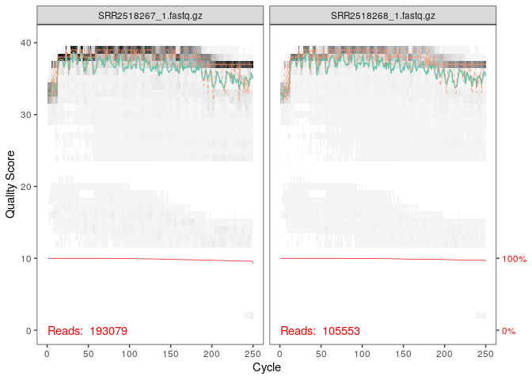
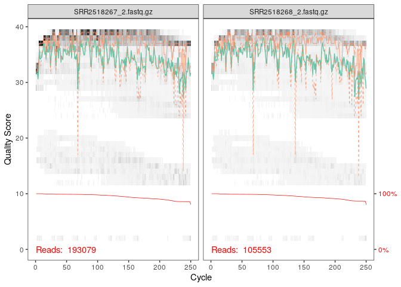
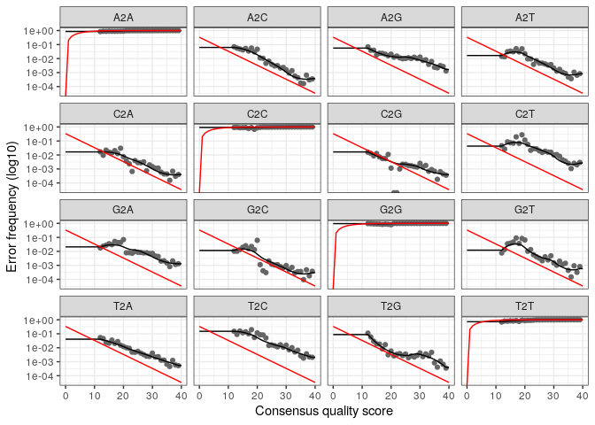
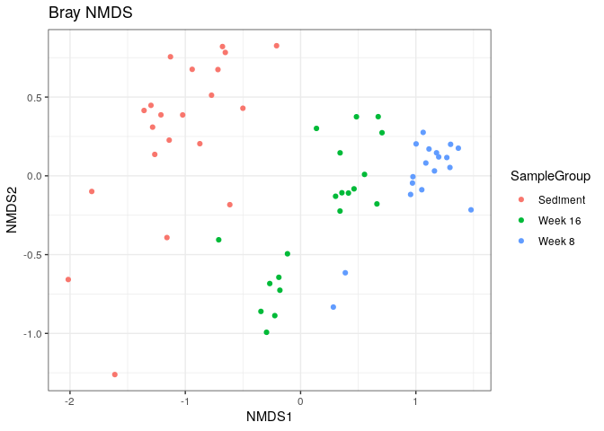
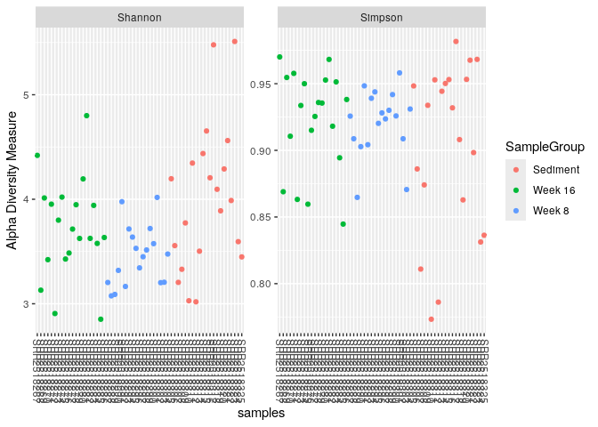
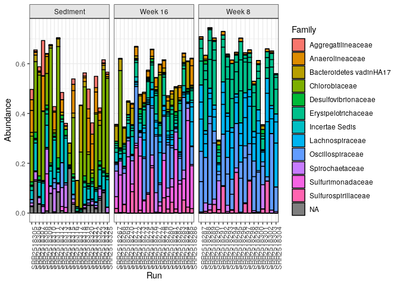
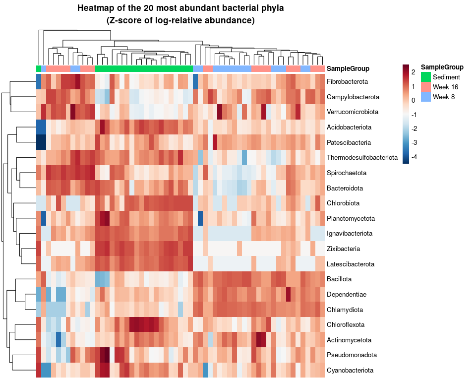

# Analyse critique de l’assemblage des communautés microbiennes

**Article analysé :**  
Pagaling E., Wang H., Venables M. et al. (2017)  
*Assembly of microbial communities in replicate nutrient-cycling model ecosystems follows divergent trajectories, leading to alternate stable states*  
_Environmental Microbiology_

**Auteur :** Tugdual DEVEAUD  
**Affiliation :** Master 1 MFA, UBO Brest  
**Encadrant :** Loïs Maignien  
**Date :** Décembre 2026

---

## Résumé

L’assemblage des communautés microbiennes résulte de l’interaction entre processus
déterministes et stochastiques. À partir des données de séquençage 16S rRNA issues de
l’étude de Pagaling et al. (2017), cette analyse vise à reproduire et discuter les
principaux résultats concernant la divergence temporelle des communautés microbiennes
dans des microcosmes expérimentaux. Les analyses de diversité alpha et bêta, de
composition taxonomique et de structuration multivariée mettent en évidence
l’émergence d’états communautaires alternatifs au cours du temps.

**Mots-clés :** microbiologie environnementale, 16S rRNA, DADA2, phyloseq, PERMANOVA,
diversité bêta, états stables alternatifs

---

[← Retour à l’accueil](index.md)

---

Analyse bioinformatique de l’article Assembly of microbial communities in
replicate nutrient-cycling model ecosystems follows divergent
trajectories, leading to alternate stable states, de Pagaling et
al. (2017)
================
2025-12-16

## 1. INTRODUCTION

L’assemblage des communautés microbiennes est influencé par des
processus déterministes et stochastiques. Comprendre comment ces
mécanismes conduisent à des trajectoires de développement divergentes
reste une question centrale en écologie microbienne. L’article “Assembly
of microbial communities in replicate nutrient-cycling model ecosystems
follows divergent trajectories, leading to alternate stable states”, de
Pagaling et al. (2017) montre que des microcosmes identiques peuvent
évoluer vers des états communautaires distincts.

Objectifs de cette analyse : 
1) Tester si les communautés diffèrent entre 8 et 16 semaines
2) Identifier les groupes taxonomiques associés à cette divergence

## 2. MATERIEL ET METHODES

# Traitement des séquences

Les séquences 16S rRNA ont été traitées à l’aide du pipeline DADA2
(Callahan et al., 2016), incluant le filtrage de qualité, la correction
des erreurs de séquençage, la fusion des lectures appariées et
l’élimination des séquences chimériques.

Les tables d’abondance des ASV, la taxonomie assignée à l’aide de la base
SILVA, ainsi que les métadonnées associées ont été intégrées dans un
objet phyloseq, utilisé pour l’ensemble des analyses statistiques.

# Analyses statistiques

Les différences de structure communautaire ont été évaluées à l’aide de
la distance de Bray–Curtis calculée à partir des abondances relatives.
Les patrons de similarité entre communautés ont été explorés par PCoA.
La significativité des différences entre groupes a été testée par
PERMANOVA (adonis2).

## 3. PACKAGES

``` r
library(dada2)
library(phyloseq)
library(vegan)
library(ggplot2)
library(dplyr)
library(pheatmap)
library(RColorBrewer)
vignette("phyloseq-basics")
vignette("phyloseq-analysis")
```

## 4. EXTRACTION DES DONNEES

``` r
raw <- readLines("/home/rstudio/article_ADM/SraRunTable (2).csv")
raw <- gsub('^"|"$', "", raw)
raw <- gsub('""', '"', raw)
writeLines(raw, "/home/rstudio/article_ADM/SraRunTable_clean.csv")
samdf <- read.csv("/home/rstudio/article_ADM/SraRunTable_clean.csv", sep = ",", header = TRUE, quote = "\"", stringsAsFactors = FALSE)
```

## 5. PIPELINE DADA2

``` r
path <- "~/article_ADM/data" # CHANGE ME to the directory containing the fastq files after unzipping.
list.files(path)
```

    ##   [1] "ena-file-download-read_run-SRP063557-fastq_ftp-20251216-0938.sh"
    ##   [2] "filtered"                                                       
    ##   [3] "silva_nr99_v138.2_toGenus_trainset.fa.gz?download=1"            
    ##   [4] "SRR2518267_1.fastq.gz"                                          
    ##   [5] "SRR2518267_2.fastq.gz"                                          
    ##   [6] "SRR2518268_1.fastq.gz"                                          
    ##   [7] "SRR2518268_2.fastq.gz"                                          
    ##   [8] "SRR2518269_1.fastq.gz"                                          
    ##   [9] "SRR2518269_2.fastq.gz"                                          
    ##  [10] "SRR2518270_1.fastq.gz"                                          
    ##  [11] "SRR2518270_2.fastq.gz"                                          
    ##  [12] "SRR2518271_1.fastq.gz"                                          
    ##  [13] "SRR2518271_2.fastq.gz"                                          
    ##  [14] "SRR2518272_1.fastq.gz"                                          
    ##  [15] "SRR2518272_2.fastq.gz"                                          
    ##  [16] "SRR2518273_1.fastq.gz"                                          
    ##  [17] "SRR2518273_2.fastq.gz"                                          
    ##  [18] "SRR2518274_1.fastq.gz"                                          
    ##  [19] "SRR2518274_2.fastq.gz"                                          
    ##  [20] "SRR2518275_1.fastq.gz"                                          
    ##  [21] "SRR2518275_2.fastq.gz"                                          
    ##  [22] "SRR2518276_1.fastq.gz"                                          
    ##  [23] "SRR2518276_2.fastq.gz"                                          
    ##  [24] "SRR2518277_1.fastq.gz"                                          
    ##  [25] "SRR2518277_2.fastq.gz"                                          
    ##  [26] "SRR2518278_1.fastq.gz"                                          
    ##  [27] "SRR2518278_2.fastq.gz"                                          
    ##  [28] "SRR2518279_1.fastq.gz"                                          
    ##  [29] "SRR2518279_2.fastq.gz"                                          
    ##  [30] "SRR2518280_1.fastq.gz"                                          
    ##  [31] "SRR2518280_2.fastq.gz"                                          
    ##  [32] "SRR2518281_1.fastq.gz"                                          
    ##  [33] "SRR2518281_2.fastq.gz"                                          
    ##  [34] "SRR2518282_1.fastq.gz"                                          
    ##  [35] "SRR2518282_2.fastq.gz"                                          
    ##  [36] "SRR2518283_1.fastq.gz"                                          
    ##  [37] "SRR2518283_2.fastq.gz"                                          
    ##  [38] "SRR2518284_1.fastq.gz"                                          
    ##  [39] "SRR2518284_2.fastq.gz"                                          
    ##  [40] "SRR2518285_1.fastq.gz"                                          
    ##  [41] "SRR2518285_2.fastq.gz"                                          
    ##  [42] "SRR2518286_1.fastq.gz"                                          
    ##  [43] "SRR2518286_2.fastq.gz"                                          
    ##  [44] "SRR2518287_1.fastq.gz"                                          
    ##  [45] "SRR2518287_2.fastq.gz"                                          
    ##  [46] "SRR2518288_1.fastq.gz"                                          
    ##  [47] "SRR2518288_2.fastq.gz"                                          
    ##  [48] "SRR2518289_1.fastq.gz"                                          
    ##  [49] "SRR2518289_2.fastq.gz"                                          
    ##  [50] "SRR2518290_1.fastq.gz"                                          
    ##  [51] "SRR2518290_2.fastq.gz"                                          
    ##  [52] "SRR2518291_1.fastq.gz"                                          
    ##  [53] "SRR2518291_2.fastq.gz"                                          
    ##  [54] "SRR2518292_1.fastq.gz"                                          
    ##  [55] "SRR2518292_2.fastq.gz"                                          
    ##  [56] "SRR2518293_1.fastq.gz"                                          
    ##  [57] "SRR2518293_2.fastq.gz"                                          
    ##  [58] "SRR2518294_1.fastq.gz"                                          
    ##  [59] "SRR2518294_2.fastq.gz"                                          
    ##  [60] "SRR2518295_1.fastq.gz"                                          
    ##  [61] "SRR2518295_2.fastq.gz"                                          
    ##  [62] "SRR2518296_1.fastq.gz"                                          
    ##  [63] "SRR2518296_2.fastq.gz"                                          
    ##  [64] "SRR2518297_1.fastq.gz"                                          
    ##  [65] "SRR2518297_2.fastq.gz"                                          
    ##  [66] "SRR2518298_1.fastq.gz"                                          
    ##  [67] "SRR2518298_2.fastq.gz"                                          
    ##  [68] "SRR2518299_1.fastq.gz"                                          
    ##  [69] "SRR2518299_2.fastq.gz"                                          
    ##  [70] "SRR2518300_1.fastq.gz"                                          
    ##  [71] "SRR2518300_2.fastq.gz"                                          
    ##  [72] "SRR2518301_1.fastq.gz"                                          
    ##  [73] "SRR2518301_2.fastq.gz"                                          
    ##  [74] "SRR2518302_1.fastq.gz"                                          
    ##  [75] "SRR2518302_2.fastq.gz"                                          
    ##  [76] "SRR2518303_1.fastq.gz"                                          
    ##  [77] "SRR2518303_2.fastq.gz"                                          
    ##  [78] "SRR2518304_1.fastq.gz"                                          
    ##  [79] "SRR2518304_2.fastq.gz"                                          
    ##  [80] "SRR2518305_1.fastq.gz"                                          
    ##  [81] "SRR2518305_2.fastq.gz"                                          
    ##  [82] "SRR2518306_1.fastq.gz"                                          
    ##  [83] "SRR2518306_2.fastq.gz"                                          
    ##  [84] "SRR2518307_1.fastq.gz"                                          
    ##  [85] "SRR2518307_2.fastq.gz"                                          
    ##  [86] "SRR2518308_1.fastq.gz"                                          
    ##  [87] "SRR2518308_2.fastq.gz"                                          
    ##  [88] "SRR2518309_1.fastq.gz"                                          
    ##  [89] "SRR2518309_2.fastq.gz"                                          
    ##  [90] "SRR2518310_1.fastq.gz"                                          
    ##  [91] "SRR2518310_2.fastq.gz"                                          
    ##  [92] "SRR2518311_1.fastq.gz"                                          
    ##  [93] "SRR2518311_2.fastq.gz"                                          
    ##  [94] "SRR2518312_1.fastq.gz"                                          
    ##  [95] "SRR2518312_2.fastq.gz"                                          
    ##  [96] "SRR2518313_1.fastq.gz"                                          
    ##  [97] "SRR2518313_2.fastq.gz"                                          
    ##  [98] "SRR2518314_1.fastq.gz"                                          
    ##  [99] "SRR2518314_2.fastq.gz"                                          
    ## [100] "SRR2518315_1.fastq.gz"                                          
    ## [101] "SRR2518315_2.fastq.gz"                                          
    ## [102] "SRR2518316_1.fastq.gz"                                          
    ## [103] "SRR2518316_2.fastq.gz"                                          
    ## [104] "SRR2518317_1.fastq.gz"                                          
    ## [105] "SRR2518317_2.fastq.gz"                                          
    ## [106] "SRR2518318_1.fastq.gz"                                          
    ## [107] "SRR2518318_2.fastq.gz"                                          
    ## [108] "SRR2518319_1.fastq.gz"                                          
    ## [109] "SRR2518319_2.fastq.gz"                                          
    ## [110] "SRR2518320_1.fastq.gz"                                          
    ## [111] "SRR2518320_2.fastq.gz"                                          
    ## [112] "SRR2518321_1.fastq.gz"                                          
    ## [113] "SRR2518321_2.fastq.gz"                                          
    ## [114] "SRR2518322_1.fastq.gz"                                          
    ## [115] "SRR2518322_2.fastq.gz"                                          
    ## [116] "SRR2518323_1.fastq.gz"                                          
    ## [117] "SRR2518323_2.fastq.gz"                                          
    ## [118] "SRR2518324_1.fastq.gz"                                          
    ## [119] "SRR2518324_2.fastq.gz"                                          
    ## [120] "SRR2518325_1.fastq.gz"                                          
    ## [121] "SRR2518325_2.fastq.gz"

``` r
fnFs <- sort(list.files(path, pattern = "_1\\.fastq\\.gz$", full.names = TRUE))
fnRs <- sort(list.files(path, pattern = "_2\\.fastq\\.gz$", full.names = TRUE))

sample.names <- sub("_1\\.fastq\\.gz$", "", basename(fnFs))
```

``` r
plotQualityProfile(fnFs[1:2])
```



``` r
plotQualityProfile(fnRs[1:2])
```



``` r
# Create filtered directory if it doesn't exist
filt_path <- file.path(path, "filtered")
dir.create(filt_path, showWarnings = FALSE)

# Define filtered file names
filtFs <- file.path(filt_path, paste0(sample.names, "_1_filt.fastq.gz"))
filtRs <- file.path(filt_path, paste0(sample.names, "_2_filt.fastq.gz"))

# Name the vectors (important for DADA2)
names(filtFs) <- sample.names
names(filtRs) <- sample.names
```

``` r
head(fnFs)
```

    ## [1] "/home/rstudio/article_ADM/data/SRR2518267_1.fastq.gz"
    ## [2] "/home/rstudio/article_ADM/data/SRR2518268_1.fastq.gz"
    ## [3] "/home/rstudio/article_ADM/data/SRR2518269_1.fastq.gz"
    ## [4] "/home/rstudio/article_ADM/data/SRR2518270_1.fastq.gz"
    ## [5] "/home/rstudio/article_ADM/data/SRR2518271_1.fastq.gz"
    ## [6] "/home/rstudio/article_ADM/data/SRR2518272_1.fastq.gz"

``` r
head(filtFs)
```

    ##                                               SRR2518267 
    ## "~/article_ADM/data/filtered/SRR2518267_1_filt.fastq.gz" 
    ##                                               SRR2518268 
    ## "~/article_ADM/data/filtered/SRR2518268_1_filt.fastq.gz" 
    ##                                               SRR2518269 
    ## "~/article_ADM/data/filtered/SRR2518269_1_filt.fastq.gz" 
    ##                                               SRR2518270 
    ## "~/article_ADM/data/filtered/SRR2518270_1_filt.fastq.gz" 
    ##                                               SRR2518271 
    ## "~/article_ADM/data/filtered/SRR2518271_1_filt.fastq.gz" 
    ##                                               SRR2518272 
    ## "~/article_ADM/data/filtered/SRR2518272_1_filt.fastq.gz"

``` r
out <- filterAndTrim(fnFs, filtFs, fnRs, filtRs, truncLen=c(240,160),
              maxN=0, maxEE=c(2,2), truncQ=2, rm.phix=TRUE,
              compress=TRUE, multithread=FALSE) # On Windows set multithread=FALSE (only needed for filterAndTrim)
head(out)
```

    ##                       reads.in reads.out
    ## SRR2518267_1.fastq.gz   193079    157758
    ## SRR2518268_1.fastq.gz   105553     88408
    ## SRR2518269_1.fastq.gz   157073    127734
    ## SRR2518270_1.fastq.gz    60529     50054
    ## SRR2518271_1.fastq.gz    88158     71082
    ## SRR2518272_1.fastq.gz   113266     91072

``` r
errF <- learnErrors(filtFs, multithread=TRUE)
```

    ## 101748960 total bases in 423954 reads from 4 samples will be used for learning the error rates.

``` r
errR <- learnErrors(filtRs, multithread=TRUE)
```

    ## 116512640 total bases in 728204 reads from 8 samples will be used for learning the error rates.

``` r
plotErrors(errF, nominalQ=TRUE)
```



``` r
dadaFs <- dada(filtFs, err=errF, multithread=TRUE)
```

    ## Sample 1 - 157758 reads in 43485 unique sequences.
    ## Sample 2 - 88408 reads in 22243 unique sequences.
    ## Sample 3 - 127734 reads in 33923 unique sequences.
    ## Sample 4 - 50054 reads in 12969 unique sequences.
    ## Sample 5 - 71082 reads in 21632 unique sequences.
    ## Sample 6 - 91072 reads in 23269 unique sequences.
    ## Sample 7 - 30352 reads in 9507 unique sequences.
    ## Sample 8 - 111744 reads in 32179 unique sequences.
    ## Sample 9 - 103417 reads in 27279 unique sequences.
    ## Sample 10 - 132434 reads in 33261 unique sequences.
    ## Sample 11 - 63892 reads in 19550 unique sequences.
    ## Sample 12 - 143987 reads in 42062 unique sequences.
    ## Sample 13 - 64673 reads in 18903 unique sequences.
    ## Sample 14 - 97436 reads in 29638 unique sequences.
    ## Sample 15 - 495097 reads in 126737 unique sequences.
    ## Sample 16 - 62424 reads in 20415 unique sequences.
    ## Sample 17 - 73189 reads in 20545 unique sequences.
    ## Sample 18 - 66671 reads in 16730 unique sequences.
    ## Sample 19 - 71154 reads in 19254 unique sequences.
    ## Sample 20 - 42083 reads in 14544 unique sequences.
    ## Sample 21 - 93234 reads in 23810 unique sequences.
    ## Sample 22 - 3383 reads in 1412 unique sequences.
    ## Sample 23 - 129536 reads in 36087 unique sequences.
    ## Sample 24 - 49435 reads in 14220 unique sequences.
    ## Sample 25 - 135506 reads in 45832 unique sequences.
    ## Sample 26 - 170425 reads in 42073 unique sequences.
    ## Sample 27 - 95096 reads in 26157 unique sequences.
    ## Sample 28 - 84544 reads in 24557 unique sequences.
    ## Sample 29 - 121140 reads in 34001 unique sequences.
    ## Sample 30 - 87025 reads in 24271 unique sequences.
    ## Sample 31 - 102305 reads in 27867 unique sequences.
    ## Sample 32 - 131505 reads in 39287 unique sequences.
    ## Sample 33 - 78552 reads in 25103 unique sequences.
    ## Sample 34 - 84550 reads in 25762 unique sequences.
    ## Sample 35 - 63252 reads in 21858 unique sequences.
    ## Sample 36 - 50385 reads in 14365 unique sequences.
    ## Sample 37 - 99372 reads in 24201 unique sequences.
    ## Sample 38 - 37466 reads in 10096 unique sequences.
    ## Sample 39 - 45286 reads in 16515 unique sequences.
    ## Sample 40 - 214755 reads in 44920 unique sequences.
    ## Sample 41 - 323568 reads in 60468 unique sequences.
    ## Sample 42 - 603428 reads in 120393 unique sequences.
    ## Sample 43 - 379866 reads in 94011 unique sequences.
    ## Sample 44 - 352897 reads in 80568 unique sequences.
    ## Sample 45 - 219358 reads in 58466 unique sequences.
    ## Sample 46 - 216251 reads in 47455 unique sequences.
    ## Sample 47 - 1611 reads in 824 unique sequences.
    ## Sample 48 - 284495 reads in 73808 unique sequences.
    ## Sample 49 - 344987 reads in 95246 unique sequences.
    ## Sample 50 - 194850 reads in 50158 unique sequences.
    ## Sample 51 - 384083 reads in 149307 unique sequences.
    ## Sample 52 - 199163 reads in 67349 unique sequences.
    ## Sample 53 - 188518 reads in 46200 unique sequences.
    ## Sample 54 - 300213 reads in 82657 unique sequences.
    ## Sample 55 - 118102 reads in 38074 unique sequences.
    ## Sample 56 - 186334 reads in 45756 unique sequences.
    ## Sample 57 - 904999 reads in 235178 unique sequences.
    ## Sample 58 - 258688 reads in 56876 unique sequences.
    ## Sample 59 - 114701 reads in 26661 unique sequences.

``` r
dadaRs <- dada(filtRs, err=errR, multithread=TRUE)
```

    ## Sample 1 - 157758 reads in 50752 unique sequences.
    ## Sample 2 - 88408 reads in 26790 unique sequences.
    ## Sample 3 - 127734 reads in 43461 unique sequences.
    ## Sample 4 - 50054 reads in 17569 unique sequences.
    ## Sample 5 - 71082 reads in 28262 unique sequences.
    ## Sample 6 - 91072 reads in 27815 unique sequences.
    ## Sample 7 - 30352 reads in 12377 unique sequences.
    ## Sample 8 - 111744 reads in 35205 unique sequences.
    ## Sample 9 - 103417 reads in 30533 unique sequences.
    ## Sample 10 - 132434 reads in 39325 unique sequences.
    ## Sample 11 - 63892 reads in 22060 unique sequences.
    ## Sample 12 - 143987 reads in 43734 unique sequences.
    ## Sample 13 - 64673 reads in 21059 unique sequences.
    ## Sample 14 - 97436 reads in 35534 unique sequences.
    ## Sample 15 - 495097 reads in 162665 unique sequences.
    ## Sample 16 - 62424 reads in 24891 unique sequences.
    ## Sample 17 - 73189 reads in 23543 unique sequences.
    ## Sample 18 - 66671 reads in 18829 unique sequences.
    ## Sample 19 - 71154 reads in 23651 unique sequences.
    ## Sample 20 - 42083 reads in 14851 unique sequences.
    ## Sample 21 - 93234 reads in 27466 unique sequences.
    ## Sample 22 - 3383 reads in 1564 unique sequences.
    ## Sample 23 - 129536 reads in 37430 unique sequences.
    ## Sample 24 - 49435 reads in 15226 unique sequences.
    ## Sample 25 - 135506 reads in 47590 unique sequences.
    ## Sample 26 - 170425 reads in 44986 unique sequences.
    ## Sample 27 - 95096 reads in 30952 unique sequences.
    ## Sample 28 - 84544 reads in 26300 unique sequences.
    ## Sample 29 - 121140 reads in 35219 unique sequences.
    ## Sample 30 - 87025 reads in 25726 unique sequences.
    ## Sample 31 - 102305 reads in 29695 unique sequences.
    ## Sample 32 - 131505 reads in 43512 unique sequences.
    ## Sample 33 - 78552 reads in 26197 unique sequences.
    ## Sample 34 - 84550 reads in 26039 unique sequences.
    ## Sample 35 - 63252 reads in 23878 unique sequences.
    ## Sample 36 - 50385 reads in 15619 unique sequences.
    ## Sample 37 - 99372 reads in 27211 unique sequences.
    ## Sample 38 - 37466 reads in 11082 unique sequences.
    ## Sample 39 - 45286 reads in 14640 unique sequences.
    ## Sample 40 - 214755 reads in 44385 unique sequences.
    ## Sample 41 - 323568 reads in 56146 unique sequences.
    ## Sample 42 - 603428 reads in 95863 unique sequences.
    ## Sample 43 - 379866 reads in 90202 unique sequences.
    ## Sample 44 - 352897 reads in 73672 unique sequences.
    ## Sample 45 - 219358 reads in 58440 unique sequences.
    ## Sample 46 - 216251 reads in 47922 unique sequences.
    ## Sample 47 - 1611 reads in 759 unique sequences.
    ## Sample 48 - 284495 reads in 74835 unique sequences.
    ## Sample 49 - 344987 reads in 91710 unique sequences.
    ## Sample 50 - 194850 reads in 47444 unique sequences.
    ## Sample 51 - 384083 reads in 133817 unique sequences.
    ## Sample 52 - 199163 reads in 63224 unique sequences.
    ## Sample 53 - 188518 reads in 42757 unique sequences.
    ## Sample 54 - 300213 reads in 67777 unique sequences.
    ## Sample 55 - 118102 reads in 32298 unique sequences.
    ## Sample 56 - 186334 reads in 44445 unique sequences.
    ## Sample 57 - 904999 reads in 249977 unique sequences.
    ## Sample 58 - 258688 reads in 57529 unique sequences.
    ## Sample 59 - 114701 reads in 24349 unique sequences.

``` r
dadaFs[[1]]
```

    ## dada-class: object describing DADA2 denoising results
    ## 864 sequence variants were inferred from 43485 input unique sequences.
    ## Key parameters: OMEGA_A = 1e-40, OMEGA_C = 1e-40, BAND_SIZE = 16

``` r
mergers <- mergePairs(dadaFs, filtFs, dadaRs, filtRs, verbose=TRUE)
head(mergers[[1]])
```

    ##                                                                                                                                                                                                                                                        sequence
    ## 1 CACGTAGGGGGCAAGCGTTGTTCGGAATTATTGGGCGTAAAGGGCATGTAGGCGGTTTCGTAAGCCTGGTGTGAAATCCTGCAGCTTAACTGTAGAATTGCATTGGGTACTGCGAGACTTGAATCATAGAGGGGAAACTAGAATTCCAGGTGTAGGGGTGGAATCTGTAGATATCTGGAAGAATACCGGTGGCGAAGGCGGGTTTCTAGCTAATGATTGACGCTGAGGTGCGAAAGTGCGGGGAGCAAACAGG
    ## 2 TACGGAGGATGCGAGCGTTATCCGGATTCATTGGGTTTAAAGGGTGCGTAGGCGGACTAATAAGTCAGTGGTGAAATCCTGCAGCTTAACTGCAGAACTGCCATTGATACTGTTAGTCTTGAGTTTGGTTAAGGTAGGCGGAATGTGTAATGTAGCGGTGAAATGCTTAGATATTACACAGAACACCAATTGCGTAGGCAGCTTACTGGACCGACACTGACGCTGAGGCACGAAAGCGTGGGGATCGAACAGG
    ## 3 CACGTATGGGGCAAGCGTTGTTCGGAATTATTGGGCGTAAAGGGTGCGCAGGCTGTGCTATAAGTCAGGTGTTAAAGGTTGGAGCTCAACTCCAACATGCCGCTTGAAACTGTAGTACTTGAGTTCTAGAGGGGAAGCTGGAATTCCTGGTGTAGGGGTGAAATCTGTAGATATCAGGAAGAACACCGGTGGCGAAGGCGAGCTTCTGGCTATGAACTGACGCTGAGGCACGAAAGTATGGGGAGCAAACAGG
    ## 4 TACGGAGGGTGCAAGCGTTACTCGGAATCACTGGGCGTAAAGGGTGCGTAGGCTGGCTTCTAAGTCAGATGTGAAATCCAATGGCTTAACCATTGAACTGCATTTGAAACTGGGAGCCTAGAGTTCAGAAGGGGCAGATGGAATTAGTGGTGTAGGGGTAAAATCCGTAGATATCACTAGGAATATCAAAAGCGAAGGCGATCTGCTGGGATGATACTGACGCTGAGGCACGAAAGCGTGGGGAGCAAACAGG
    ## 5 TACGGAGGATGCAAGCGTTATCCGGATTTATTGGGTTTAAAGGGTGCGTAGGCGGATTAATAAGTCAGTGGTGAAATCTTGCGGCTCAACCGTAATATTGCCATTGATACTGTTAGTCTTGAATGCAGTTGAGGTAGGCGGAATGTGTAATGTAGCGGTGAAATGCTTAGATATTACACAGAACACCGATTGCGAAGGCAGCTTGCTAAACTGTGATTGACGCTGATGCACGAAAGCGTGGGGATCAAACAGG
    ## 6 TACGTAGGTGGCAAGCGTTGTCCGGAATTACTGGGCGTAAAGGGCGTGTAGGCGGCCTTTTAAGTCAGACGTGAAATCCCTGGGCTTAACCCAGGACCTGCGTTTGAAACTGGAGGGCTTGAGGACCGGAGAGGGTAGTGGAATTCCCAGTGTAGCGGTGAAATGCGTAGATATTGGGAGGAACACCAGTGGCGAAGGCGACTGCCTGGACGGCACCTGACGCTGAGGCGCGAAAGCCAGGGGAGCAAACGGG
    ##   abundance forward reverse nmatch nmismatch nindel prefer accept
    ## 1     15398       1       1    147         0      0      1   TRUE
    ## 2      9011       2       2    147         0      0      1   TRUE
    ## 3      8481       3       3    147         0      0      1   TRUE
    ## 4      7109       4       4    147         0      0      1   TRUE
    ## 5      6013       6       6    147         0      0      1   TRUE
    ## 6      5904       5       5    147         0      0      1   TRUE

``` r
seqtab <- makeSequenceTable(mergers)
dim(seqtab)
```

    ## [1]    59 15345

``` r
table(nchar(getSequences(seqtab)))
```

    ## 
    ##   240   242   245   246   247   248   250   251   252   253   254   255   256 
    ##    20     1     1     1     1     1     6    13   562 13834   844    37     3 
    ##   257   259   271   273   275   279   290   291   297   299   300   305   307 
    ##     4     1     1     2     1     1     1     2     1     1     1     1     2 
    ##   310   356 
    ##     1     1

``` r
seqtab.nochim <- removeBimeraDenovo(seqtab, method="consensus", multithread=TRUE, verbose=TRUE)
dim(seqtab.nochim)
```

    ## [1]    59 10006

``` r
sum(seqtab.nochim)/sum(seqtab)
```

    ## [1] 0.9397359

``` r
getN <- function(x) sum(getUniques(x))
track <- cbind(out, sapply(dadaFs, getN), sapply(dadaRs, getN), sapply(mergers, getN), rowSums(seqtab.nochim))
colnames(track) <- c("input", "filtered", "denoisedF", "denoisedR", "merged", "nonchim")
rownames(track) <- sample.names
head(track)
```

    ##             input filtered denoisedF denoisedR merged nonchim
    ## SRR2518267 193079   157758    155842    156202 150982  149463
    ## SRR2518268 105553    88408     86398     87099  82296   75739
    ## SRR2518269 157073   127734    125868    126153 120912  118241
    ## SRR2518270  60529    50054     48948     49058  46291   44210
    ## SRR2518271  88158    71082     69484     69742  65253   62344
    ## SRR2518272 113266    91072     89367     89923  83133   72487

``` r
taxa <- assignTaxonomy(seqtab.nochim, "~/article_ADM/data/silva_nr99_v138.2_toGenus_trainset.fa.gz?download=1", multithread=TRUE)
```

``` r
taxa.print <- taxa 
rownames(taxa.print) <- NULL
head(taxa.print)
```

    ##      Kingdom    Phylum          Class          Order               
    ## [1,] "Bacteria" "Chlorobiota"   "Chlorobia"    "Chlorobiales"      
    ## [2,] "Bacteria" "Bacillota"     "Clostridia"   "Oscillospirales"   
    ## [3,] "Bacteria" "Bacillota"     "Limnochordia" "Incertae Sedis"    
    ## [4,] "Bacteria" "Bacillota"     "Bacilli"      "Erysipelotrichales"
    ## [5,] "Bacteria" "Spirochaetota" "Spirochaetia" "Spirochaetales"    
    ## [6,] "Bacteria" "Bacteroidota"  "Bacteroidia"  "Bacteroidales"     
    ##      Family                    Genus           
    ## [1,] "Chlorobiaceae"           "Chlorobium"    
    ## [2,] "Oscillospiraceae"        NA              
    ## [3,] "Incertae Sedis"          "Hydrogenispora"
    ## [4,] "Erysipelotrichaceae"     "Erysipelothrix"
    ## [5,] "Spirochaetaceae"         "Teretinema"    
    ## [6,] "Bacteroidetes vadinHA17" NA

``` r
theme_set(theme_bw())
```

``` r
rownames(samdf) <- samdf$Run


length(rownames(seqtab.nochim))
```

    ## [1] 59

``` r
length(rownames(samdf))
```

    ## [1] 59

``` r
common.samples <- intersect(rownames(seqtab.nochim), rownames(samdf))
length(common.samples)
```

    ## [1] 59

``` r
seqtab.nochim <- seqtab.nochim[common.samples, , drop = FALSE]
samdf <- samdf[common.samples, , drop = FALSE]
```

``` r
# Check sample name matching
all(rownames(seqtab.nochim) %in% rownames(samdf))
```

    ## [1] TRUE

``` r
all(rownames(samdf) %in% rownames(seqtab.nochim))
```

    ## [1] TRUE

## 6. CREATION DE L’OBJET PHYLOSEQ

``` r
ps <- phyloseq(
  otu_table(seqtab.nochim, taxa_are_rows = FALSE),
  sample_data(samdf),
  tax_table(taxa)
)
```

## 7. Création des groupes d’échantillons

``` r
samdf$SampleGroup <- ifelse(grepl("^16", samdf$Sample.Name), "Week 16",
                       ifelse(grepl("^8",  samdf$Sample.Name), "Week 8",
                       ifelse(grepl("^SA", samdf$Sample.Name), "Sediment",
                              "Other")))
sample_data(ps) <- samdf
```

## 8. TEST D’ALPHA DIVERSITE

``` r
plot_richness(ps, measures=c("Shannon", "Simpson"), color="SampleGroup")
```


Les indices de Shannon et Simpson suggèrent des différences de diversité
alpha entre les groupes d’échantillons, avec une tendance à une
diversification accrue au cours du temps, bien que ces différences
restent modérées comparées aux variations observées en diversité beta.

## 9. TEST DE BETA DIVERSITE (BRAY-CURTIS)

``` r
ps.prop <- transform_sample_counts(ps, function(otu) otu/sum(otu))
ord.nmds.bray <- ordinate(ps.prop, method="NMDS", distance="bray")
```

    ## Run 0 stress 0.105359 
    ## Run 1 stress 0.1253495 
    ## Run 2 stress 0.1061354 
    ## Run 3 stress 0.1062157 
    ## Run 4 stress 0.1062124 
    ## Run 5 stress 0.1053075 
    ## ... New best solution
    ## ... Procrustes: rmse 0.005936755  max resid 0.02818313 
    ## Run 6 stress 0.1115173 
    ## Run 7 stress 0.1062157 
    ## Run 8 stress 0.1052461 
    ## ... New best solution
    ## ... Procrustes: rmse 0.01131588  max resid 0.05281257 
    ## Run 9 stress 0.1109145 
    ## Run 10 stress 0.1061354 
    ## Run 11 stress 0.1109144 
    ## Run 12 stress 0.1062157 
    ## Run 13 stress 0.1062157 
    ## Run 14 stress 0.1108904 
    ## Run 15 stress 0.1051972 
    ## ... New best solution
    ## ... Procrustes: rmse 0.004942594  max resid 0.03461872 
    ## Run 16 stress 0.1113811 
    ## Run 17 stress 0.1115173 
    ## Run 18 stress 0.1109144 
    ## Run 19 stress 0.1053592 
    ## ... Procrustes: rmse 0.01068824  max resid 0.05018776 
    ## Run 20 stress 0.105359 
    ## ... Procrustes: rmse 0.01058587  max resid 0.04910829 
    ## *** Best solution was not repeated -- monoMDS stopping criteria:
    ##     20: stress ratio > sratmax

``` r
plot_ordination(ps.prop, ord.nmds.bray, color="SampleGroup", title="Bray NMDS")
```



## 10. PCoA

``` r
ps.rel <- transform_sample_counts(ps, function(x) x / sum(x))

ord.pcoa <- ordinate(ps.rel, method = "PCoA", distance = "bray")


plot_ordination(ps.rel, ord.pcoa, color = "SampleGroup") +
  geom_point(size = 2) +
  stat_ellipse() +
  ggtitle("PCoA - Bray-Curtis")
```


–> Analyse PCoA basée sur les distances de Bray–Curtis entre
communautés microbiennes sédimentaires, ainsi qu’à 8 et 16 semaines.

L’analyse en coordonnées principales montre une séparation claire entre
les communautés microbiennes sédimentaires, celles échantillonnées à 8
semaines et celles échantillonnées à 16 semaines. Les échantillons de
même durée d’incubation tendent à se regrouper, indiquant une
structuration temporelle marquée des communautés.

## 11. PERMANOVA

``` r
ps.rel <- transform_sample_counts(ps, function(x) x / sum(x))
dist.bray <- phyloseq::distance(ps.rel, method = "bray")

meta <- as(sample_data(ps.rel), "data.frame")

adonis2(dist.bray ~ SampleGroup, data = meta, permutations = 999)
```

    ## Permutation test for adonis under reduced model
    ## Permutation: free
    ## Number of permutations: 999
    ## 
    ## adonis2(formula = dist.bray ~ SampleGroup, data = meta, permutations = 999)
    ##          Df SumOfSqs      R2      F Pr(>F)    
    ## Model     2   7.0061 0.42314 20.539  0.001 ***
    ## Residual 56   9.5512 0.57686                  
    ## Total    58  16.5573 1.00000                  
    ## ---
    ## Signif. codes:  0 '***' 0.001 '**' 0.01 '*' 0.05 '.' 0.1 ' ' 1

``` r
bd <- betadisper(dist.bray, meta$SampleGroup)
anova(bd)
```

    ## Analysis of Variance Table
    ## 
    ## Response: Distances
    ##           Df  Sum Sq  Mean Sq F value  Pr(>F)  
    ## Groups     2 0.13941 0.069707  4.3215 0.01798 *
    ## Residuals 56 0.90331 0.016131                  
    ## ---
    ## Signif. codes:  0 '***' 0.001 '**' 0.01 '*' 0.05 '.' 0.1 ' ' 1

La PERMANOVA a mis en évidence un effet significatif du facteur SampleGroup sur la structure des communautés microbiennes (Bray–Curtis, R² = 0,42, p = 0,001). Néanmoins, une différence significative de dispersion multivariée a également été observée entre les groupes (betadisper, p = 0,018), suggérant que l’effet détecté pourrait être partiellement influencé par une hétérogénéité de la variabilité au sein des groupes.
La significativité de la PERMANOVA doit être interprétée avec prudence,
car les différences observées entre groupes peuvent être partiellement
attribuées à une hétérogénéité de dispersion intra-groupe.

## 12. COMPOSITION TAXONOMIQUE

``` r
top10 <- names(sort(taxa_sums(ps), decreasing = TRUE))[1:10]


ps.prop <- transform_sample_counts(ps, function(x) x / sum(x))


ps.top10 <- prune_taxa(top10, ps.prop)


plot_bar(ps.top10, x = "Run", fill = "Phylum") +
  facet_wrap(~SampleGroup, scales = "free_x") +
  theme_bw() +
  ylab("Abondance relative") +
  ggtitle("Phylum bactériens dominants")
```



``` r
  theme(
    axis.text.x = element_text(angle = 90, hjust = 1),
    strip.background = element_rect(fill = "grey90")
  )
```

    ## <theme> List of 2
    ##  $ axis.text.x     : <ggplot2::element_text>
    ##   ..@ family       : NULL
    ##   ..@ face         : NULL
    ##   ..@ italic       : chr NA
    ##   ..@ fontweight   : num NA
    ##   ..@ fontwidth    : num NA
    ##   ..@ colour       : NULL
    ##   ..@ size         : NULL
    ##   ..@ hjust        : num 1
    ##   ..@ vjust        : NULL
    ##   ..@ angle        : num 90
    ##   ..@ lineheight   : NULL
    ##   ..@ margin       : NULL
    ##   ..@ debug        : NULL
    ##   ..@ inherit.blank: logi FALSE
    ##  $ strip.background: <ggplot2::element_rect>
    ##   ..@ fill         : chr "grey90"
    ##   ..@ colour       : NULL
    ##   ..@ linewidth    : NULL
    ##   ..@ linetype     : NULL
    ##   ..@ linejoin     : NULL
    ##   ..@ inherit.blank: logi FALSE
    ##  @ complete: logi FALSE
    ##  @ validate: logi TRUE

Les analyses de composition taxonomique ont été réalisées au niveau du
phylum afin de mettre en évidence les grandes tendances structurelles
des communautés.

## 13. HEATMAP

``` r
ps.rel <- transform_sample_counts(ps, function(x) x / sum(x))


ps.phylum <- tax_glom(ps.rel, taxrank = "Phylum")


top20 <- names(sort(taxa_sums(ps.phylum), decreasing = TRUE))[1:20]
ps.phylum.top <- prune_taxa(top20, ps.phylum)


mat <- as(otu_table(ps.phylum.top), "matrix")
if (!taxa_are_rows(ps.phylum.top)) mat <- t(mat)


mat <- matrix(as.numeric(mat),
              nrow = nrow(mat),
              dimnames = dimnames(mat))
mat[!is.finite(mat)] <- 0


mat.log <- log10(mat + 1e-6)


mat.z <- t(scale(t(mat.log)))
mat.z[!is.finite(mat.z)] <- 0


tax <- as(tax_table(ps.phylum.top), "matrix")
rownames(mat.z) <- tax[, "Phylum"]


ann_col <- data.frame(
  SampleGroup = sample_data(ps.phylum.top)$SampleGroup
)
rownames(ann_col) <- sample_names(ps.phylum.top)


ord <- order(ann_col$SampleGroup)
mat.z <- mat.z[, ord]
ann_col <- ann_col[ord, , drop = FALSE]


col_fun <- colorRampPalette(rev(brewer.pal(11, "RdBu")))(100)


pheatmap(mat.z,
         annotation_col = ann_col,
         color = col_fun,
         scale = "none",
         clustering_method = "average",
         clustering_distance_rows = "euclidean",
         clustering_distance_cols = "euclidean",
         show_colnames = FALSE,
         fontsize_row = 10,
         fontsize_col = 8,
         border_color = NA,
         main = "Heatmap of the 20 most abundant bacterial phyla\n(Z-score of log-relative abundance)")
```



La heatmap met en évidence des profils taxonomiques distincts selon les
groupes d’échantillons, confirmant les différences observées dans les
analyses de diversité beta.

## DISCUSSION

Les résultats obtenus montrent que des communautés microbiennes
initialement similaires peuvent diverger fortement au cours du temps,
même lorsqu’elles évoluent dans des conditions environnementales
contrôlées. La séparation nette observée entre 8 et 16 semaines suggère
que la dynamique temporelle joue un rôle clé dans l’assemblage des
communautés.

Ces observations sont cohérentes avec les conclusions de Pagaling et
al. (2017), qui proposent que des trajectoires alternatives d’assemblage
puissent émerger à la suite d’une phase initiale de faible diversité. La
divergence observée pourrait résulter d’effets stochastiques amplifiés
par des interactions biologiques et des rétroactions fonctionnelles au
sein des communautés.

Cependant, notre analyse reste volontairement limitée par rapport à
l’étude originale, qui inclut des approches fonctionnelles et
métagénomiques plus approfondies. Néanmoins, cette reproduction
partielle met en évidence l’intérêt des analyses de diversité beta et de
composition taxonomique pour explorer les mécanismes d’assemblage des
communautés microbiennes.

## CONCLUSION

Cette analyse montre que la structure des communautés microbiennes
évolue significativement entre 8 et 16 semaines d’incubation, avec une
divergence marquée de leur composition. Les résultats soutiennent
l’hypothèse selon laquelle des communautés microbiennes répliquées
peuvent suivre des trajectoires de développement distinctes, contribuant
à la compréhension des états alternatifs en écologie microbienne.
