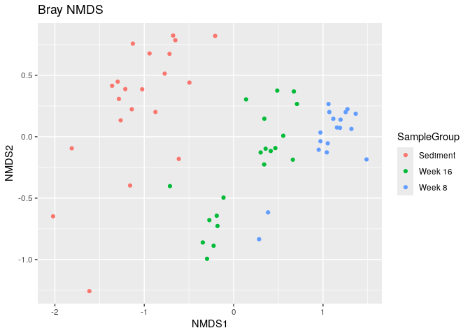
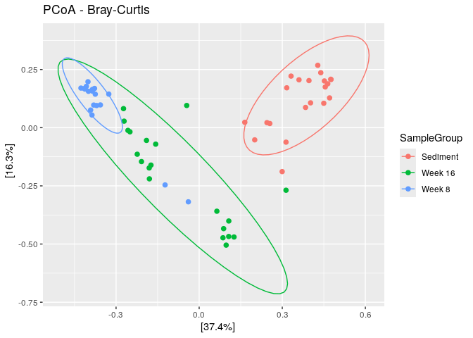
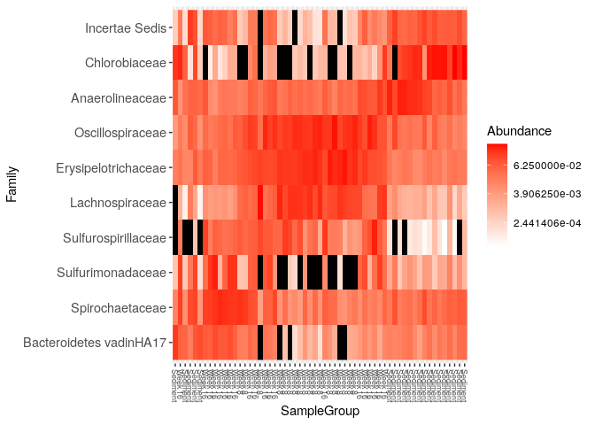
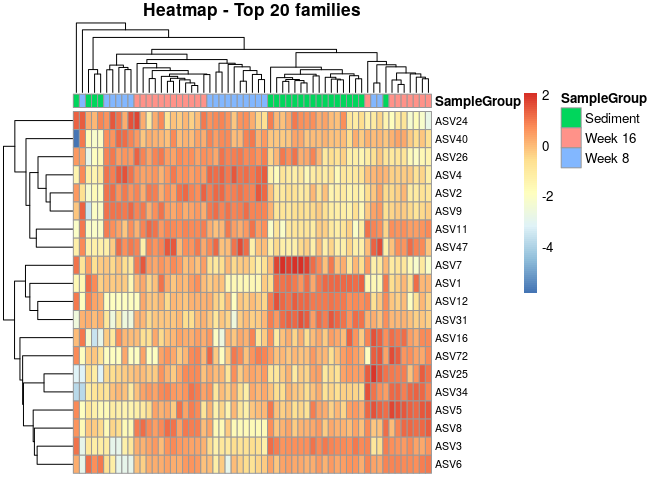

analyse_article
================
2025-12-16

``` r
library(dada2); packageVersion("dada2")
```

    ## [1] '1.28.0'

``` r
library(phangorn)
```

    ## Loading required package: ape

    ## 
    ## Attaching package: 'ape'

    ## The following object is masked from 'package:Biostrings':
    ## 
    ##     complement

``` r
# Lire brut
raw <- readLines("/home/rstudio/article_ADM/SraRunTable (2).csv")

# 1. Supprimer les guillemets de début et de fin de ligne
raw <- gsub('^"|"$', "", raw)

# 2. Remplacer les doubles guillemets "" par un seul "
raw <- gsub('""', '"', raw)

# Sauver un fichier propre
writeLines(raw, "/home/rstudio/article_ADM/SraRunTable_clean.csv")

# Relire avec R
samdf <- read.csv("/home/rstudio/article_ADM/SraRunTable_clean.csv", sep = ",", header = TRUE, quote = "\"", stringsAsFactors = FALSE)
```

``` r
path <- "~/article_ADM/data" # CHANGE ME to the directory containing the fastq files after unzipping.
list.files(path)
```

    ##   [1] "ena-file-download-read_run-SRP063557-fastq_ftp-20251216-0938.sh"
    ##   [2] "filtered"                                                       
    ##   [3] "silva_nr99_v138.2_toGenus_trainset.fa.gz?download=1"            
    ##   [4] "SRR2518267_1.fastq.gz"                                          
    ##   [5] "SRR2518267_2.fastq.gz"                                          
    ##   [6] "SRR2518268_1.fastq.gz"                                          
    ##   [7] "SRR2518268_2.fastq.gz"                                          
    ##   [8] "SRR2518269_1.fastq.gz"                                          
    ##   [9] "SRR2518269_2.fastq.gz"                                          
    ##  [10] "SRR2518270_1.fastq.gz"                                          
    ##  [11] "SRR2518270_2.fastq.gz"                                          
    ##  [12] "SRR2518271_1.fastq.gz"                                          
    ##  [13] "SRR2518271_2.fastq.gz"                                          
    ##  [14] "SRR2518272_1.fastq.gz"                                          
    ##  [15] "SRR2518272_2.fastq.gz"                                          
    ##  [16] "SRR2518273_1.fastq.gz"                                          
    ##  [17] "SRR2518273_2.fastq.gz"                                          
    ##  [18] "SRR2518274_1.fastq.gz"                                          
    ##  [19] "SRR2518274_2.fastq.gz"                                          
    ##  [20] "SRR2518275_1.fastq.gz"                                          
    ##  [21] "SRR2518275_2.fastq.gz"                                          
    ##  [22] "SRR2518276_1.fastq.gz"                                          
    ##  [23] "SRR2518276_2.fastq.gz"                                          
    ##  [24] "SRR2518277_1.fastq.gz"                                          
    ##  [25] "SRR2518277_2.fastq.gz"                                          
    ##  [26] "SRR2518278_1.fastq.gz"                                          
    ##  [27] "SRR2518278_2.fastq.gz"                                          
    ##  [28] "SRR2518279_1.fastq.gz"                                          
    ##  [29] "SRR2518279_2.fastq.gz"                                          
    ##  [30] "SRR2518280_1.fastq.gz"                                          
    ##  [31] "SRR2518280_2.fastq.gz"                                          
    ##  [32] "SRR2518281_1.fastq.gz"                                          
    ##  [33] "SRR2518281_2.fastq.gz"                                          
    ##  [34] "SRR2518282_1.fastq.gz"                                          
    ##  [35] "SRR2518282_2.fastq.gz"                                          
    ##  [36] "SRR2518283_1.fastq.gz"                                          
    ##  [37] "SRR2518283_2.fastq.gz"                                          
    ##  [38] "SRR2518284_1.fastq.gz"                                          
    ##  [39] "SRR2518284_2.fastq.gz"                                          
    ##  [40] "SRR2518285_1.fastq.gz"                                          
    ##  [41] "SRR2518285_2.fastq.gz"                                          
    ##  [42] "SRR2518286_1.fastq.gz"                                          
    ##  [43] "SRR2518286_2.fastq.gz"                                          
    ##  [44] "SRR2518287_1.fastq.gz"                                          
    ##  [45] "SRR2518287_2.fastq.gz"                                          
    ##  [46] "SRR2518288_1.fastq.gz"                                          
    ##  [47] "SRR2518288_2.fastq.gz"                                          
    ##  [48] "SRR2518289_1.fastq.gz"                                          
    ##  [49] "SRR2518289_2.fastq.gz"                                          
    ##  [50] "SRR2518290_1.fastq.gz"                                          
    ##  [51] "SRR2518290_2.fastq.gz"                                          
    ##  [52] "SRR2518291_1.fastq.gz"                                          
    ##  [53] "SRR2518291_2.fastq.gz"                                          
    ##  [54] "SRR2518292_1.fastq.gz"                                          
    ##  [55] "SRR2518292_2.fastq.gz"                                          
    ##  [56] "SRR2518293_1.fastq.gz"                                          
    ##  [57] "SRR2518293_2.fastq.gz"                                          
    ##  [58] "SRR2518294_1.fastq.gz"                                          
    ##  [59] "SRR2518294_2.fastq.gz"                                          
    ##  [60] "SRR2518295_1.fastq.gz"                                          
    ##  [61] "SRR2518295_2.fastq.gz"                                          
    ##  [62] "SRR2518296_1.fastq.gz"                                          
    ##  [63] "SRR2518296_2.fastq.gz"                                          
    ##  [64] "SRR2518297_1.fastq.gz"                                          
    ##  [65] "SRR2518297_2.fastq.gz"                                          
    ##  [66] "SRR2518298_1.fastq.gz"                                          
    ##  [67] "SRR2518298_2.fastq.gz"                                          
    ##  [68] "SRR2518299_1.fastq.gz"                                          
    ##  [69] "SRR2518299_2.fastq.gz"                                          
    ##  [70] "SRR2518300_1.fastq.gz"                                          
    ##  [71] "SRR2518300_2.fastq.gz"                                          
    ##  [72] "SRR2518301_1.fastq.gz"                                          
    ##  [73] "SRR2518301_2.fastq.gz"                                          
    ##  [74] "SRR2518302_1.fastq.gz"                                          
    ##  [75] "SRR2518302_2.fastq.gz"                                          
    ##  [76] "SRR2518303_1.fastq.gz"                                          
    ##  [77] "SRR2518303_2.fastq.gz"                                          
    ##  [78] "SRR2518304_1.fastq.gz"                                          
    ##  [79] "SRR2518304_2.fastq.gz"                                          
    ##  [80] "SRR2518305_1.fastq.gz"                                          
    ##  [81] "SRR2518305_2.fastq.gz"                                          
    ##  [82] "SRR2518306_1.fastq.gz"                                          
    ##  [83] "SRR2518306_2.fastq.gz"                                          
    ##  [84] "SRR2518307_1.fastq.gz"                                          
    ##  [85] "SRR2518307_2.fastq.gz"                                          
    ##  [86] "SRR2518308_1.fastq.gz"                                          
    ##  [87] "SRR2518308_2.fastq.gz"                                          
    ##  [88] "SRR2518309_1.fastq.gz"                                          
    ##  [89] "SRR2518309_2.fastq.gz"                                          
    ##  [90] "SRR2518310_1.fastq.gz"                                          
    ##  [91] "SRR2518310_2.fastq.gz"                                          
    ##  [92] "SRR2518311_1.fastq.gz"                                          
    ##  [93] "SRR2518311_2.fastq.gz"                                          
    ##  [94] "SRR2518312_1.fastq.gz"                                          
    ##  [95] "SRR2518312_2.fastq.gz"                                          
    ##  [96] "SRR2518313_1.fastq.gz"                                          
    ##  [97] "SRR2518313_2.fastq.gz"                                          
    ##  [98] "SRR2518314_1.fastq.gz"                                          
    ##  [99] "SRR2518314_2.fastq.gz"                                          
    ## [100] "SRR2518315_1.fastq.gz"                                          
    ## [101] "SRR2518315_2.fastq.gz"                                          
    ## [102] "SRR2518316_1.fastq.gz"                                          
    ## [103] "SRR2518316_2.fastq.gz"                                          
    ## [104] "SRR2518317_1.fastq.gz"                                          
    ## [105] "SRR2518317_2.fastq.gz"                                          
    ## [106] "SRR2518318_1.fastq.gz"                                          
    ## [107] "SRR2518318_2.fastq.gz"                                          
    ## [108] "SRR2518319_1.fastq.gz"                                          
    ## [109] "SRR2518319_2.fastq.gz"                                          
    ## [110] "SRR2518320_1.fastq.gz"                                          
    ## [111] "SRR2518320_2.fastq.gz"                                          
    ## [112] "SRR2518321_1.fastq.gz"                                          
    ## [113] "SRR2518321_2.fastq.gz"                                          
    ## [114] "SRR2518322_1.fastq.gz"                                          
    ## [115] "SRR2518322_2.fastq.gz"                                          
    ## [116] "SRR2518323_1.fastq.gz"                                          
    ## [117] "SRR2518323_2.fastq.gz"                                          
    ## [118] "SRR2518324_1.fastq.gz"                                          
    ## [119] "SRR2518324_2.fastq.gz"                                          
    ## [120] "SRR2518325_1.fastq.gz"                                          
    ## [121] "SRR2518325_2.fastq.gz"

``` r
# List forward and reverse reads
fnFs <- sort(list.files(path, pattern = "_1\\.fastq\\.gz$", full.names = TRUE))
fnRs <- sort(list.files(path, pattern = "_2\\.fastq\\.gz$", full.names = TRUE))

# Extract sample names
sample.names <- sub("_1\\.fastq\\.gz$", "", basename(fnFs))
```

``` r
plotQualityProfile(fnFs[1:2])
```

<!-- -->

``` r
plotQualityProfile(fnRs[1:2])
```

<!-- -->

``` r
# Create filtered directory if it doesn't exist
filt_path <- file.path(path, "filtered")
dir.create(filt_path, showWarnings = FALSE)

# Define filtered file names
filtFs <- file.path(filt_path, paste0(sample.names, "_1_filt.fastq.gz"))
filtRs <- file.path(filt_path, paste0(sample.names, "_2_filt.fastq.gz"))

# Name the vectors (important for DADA2)
names(filtFs) <- sample.names
names(filtRs) <- sample.names
```

``` r
head(fnFs)
```

    ## [1] "/home/rstudio/article_ADM/data/SRR2518267_1.fastq.gz"
    ## [2] "/home/rstudio/article_ADM/data/SRR2518268_1.fastq.gz"
    ## [3] "/home/rstudio/article_ADM/data/SRR2518269_1.fastq.gz"
    ## [4] "/home/rstudio/article_ADM/data/SRR2518270_1.fastq.gz"
    ## [5] "/home/rstudio/article_ADM/data/SRR2518271_1.fastq.gz"
    ## [6] "/home/rstudio/article_ADM/data/SRR2518272_1.fastq.gz"

``` r
head(filtFs)
```

    ##                                               SRR2518267 
    ## "~/article_ADM/data/filtered/SRR2518267_1_filt.fastq.gz" 
    ##                                               SRR2518268 
    ## "~/article_ADM/data/filtered/SRR2518268_1_filt.fastq.gz" 
    ##                                               SRR2518269 
    ## "~/article_ADM/data/filtered/SRR2518269_1_filt.fastq.gz" 
    ##                                               SRR2518270 
    ## "~/article_ADM/data/filtered/SRR2518270_1_filt.fastq.gz" 
    ##                                               SRR2518271 
    ## "~/article_ADM/data/filtered/SRR2518271_1_filt.fastq.gz" 
    ##                                               SRR2518272 
    ## "~/article_ADM/data/filtered/SRR2518272_1_filt.fastq.gz"

``` r
out <- filterAndTrim(fnFs, filtFs, fnRs, filtRs, truncLen=c(240,160),
              maxN=0, maxEE=c(2,2), truncQ=2, rm.phix=TRUE,
              compress=TRUE, multithread=FALSE) # On Windows set multithread=FALSE (only needed for filterAndTrim)
head(out)
```

    ##                       reads.in reads.out
    ## SRR2518267_1.fastq.gz   193079    157758
    ## SRR2518268_1.fastq.gz   105553     88408
    ## SRR2518269_1.fastq.gz   157073    127734
    ## SRR2518270_1.fastq.gz    60529     50054
    ## SRR2518271_1.fastq.gz    88158     71082
    ## SRR2518272_1.fastq.gz   113266     91072

``` r
errF <- learnErrors(filtFs, multithread=TRUE)
```

    ## 101748960 total bases in 423954 reads from 4 samples will be used for learning the error rates.

``` r
errR <- learnErrors(filtRs, multithread=TRUE)
```

    ## 116512640 total bases in 728204 reads from 8 samples will be used for learning the error rates.

``` r
plotErrors(errF, nominalQ=TRUE)
```

    ## Warning in scale_y_log10(): log-10 transformation introduced infinite values.
    ## log-10 transformation introduced infinite values.

<!-- -->

``` r
dadaFs <- dada(filtFs, err=errF, multithread=TRUE)
```

    ## Sample 1 - 157758 reads in 43485 unique sequences.
    ## Sample 2 - 88408 reads in 22243 unique sequences.
    ## Sample 3 - 127734 reads in 33923 unique sequences.
    ## Sample 4 - 50054 reads in 12969 unique sequences.
    ## Sample 5 - 71082 reads in 21632 unique sequences.
    ## Sample 6 - 91072 reads in 23269 unique sequences.
    ## Sample 7 - 30352 reads in 9507 unique sequences.
    ## Sample 8 - 111744 reads in 32179 unique sequences.
    ## Sample 9 - 103417 reads in 27279 unique sequences.
    ## Sample 10 - 132434 reads in 33261 unique sequences.
    ## Sample 11 - 63892 reads in 19550 unique sequences.
    ## Sample 12 - 143987 reads in 42062 unique sequences.
    ## Sample 13 - 64673 reads in 18903 unique sequences.
    ## Sample 14 - 97436 reads in 29638 unique sequences.
    ## Sample 15 - 495097 reads in 126737 unique sequences.
    ## Sample 16 - 62424 reads in 20415 unique sequences.
    ## Sample 17 - 73189 reads in 20545 unique sequences.
    ## Sample 18 - 66671 reads in 16730 unique sequences.
    ## Sample 19 - 71154 reads in 19254 unique sequences.
    ## Sample 20 - 42083 reads in 14544 unique sequences.
    ## Sample 21 - 93234 reads in 23810 unique sequences.
    ## Sample 22 - 3383 reads in 1412 unique sequences.
    ## Sample 23 - 129536 reads in 36087 unique sequences.
    ## Sample 24 - 49435 reads in 14220 unique sequences.
    ## Sample 25 - 135506 reads in 45832 unique sequences.
    ## Sample 26 - 170425 reads in 42073 unique sequences.
    ## Sample 27 - 95096 reads in 26157 unique sequences.
    ## Sample 28 - 84544 reads in 24557 unique sequences.
    ## Sample 29 - 121140 reads in 34001 unique sequences.
    ## Sample 30 - 87025 reads in 24271 unique sequences.
    ## Sample 31 - 102305 reads in 27867 unique sequences.
    ## Sample 32 - 131505 reads in 39287 unique sequences.
    ## Sample 33 - 78552 reads in 25103 unique sequences.
    ## Sample 34 - 84550 reads in 25762 unique sequences.
    ## Sample 35 - 63252 reads in 21858 unique sequences.
    ## Sample 36 - 50385 reads in 14365 unique sequences.
    ## Sample 37 - 99372 reads in 24201 unique sequences.
    ## Sample 38 - 37466 reads in 10096 unique sequences.
    ## Sample 39 - 45286 reads in 16515 unique sequences.
    ## Sample 40 - 214755 reads in 44920 unique sequences.
    ## Sample 41 - 323568 reads in 60468 unique sequences.
    ## Sample 42 - 603428 reads in 120393 unique sequences.
    ## Sample 43 - 379866 reads in 94011 unique sequences.
    ## Sample 44 - 352897 reads in 80568 unique sequences.
    ## Sample 45 - 219358 reads in 58466 unique sequences.
    ## Sample 46 - 216251 reads in 47455 unique sequences.
    ## Sample 47 - 1611 reads in 824 unique sequences.
    ## Sample 48 - 284495 reads in 73808 unique sequences.
    ## Sample 49 - 344987 reads in 95246 unique sequences.
    ## Sample 50 - 194850 reads in 50158 unique sequences.
    ## Sample 51 - 384083 reads in 149307 unique sequences.
    ## Sample 52 - 199163 reads in 67349 unique sequences.
    ## Sample 53 - 188518 reads in 46200 unique sequences.
    ## Sample 54 - 300213 reads in 82657 unique sequences.
    ## Sample 55 - 118102 reads in 38074 unique sequences.
    ## Sample 56 - 186334 reads in 45756 unique sequences.
    ## Sample 57 - 904999 reads in 235178 unique sequences.
    ## Sample 58 - 258688 reads in 56876 unique sequences.
    ## Sample 59 - 114701 reads in 26661 unique sequences.

``` r
dadaRs <- dada(filtRs, err=errR, multithread=TRUE)
```

    ## Sample 1 - 157758 reads in 50752 unique sequences.
    ## Sample 2 - 88408 reads in 26790 unique sequences.
    ## Sample 3 - 127734 reads in 43461 unique sequences.
    ## Sample 4 - 50054 reads in 17569 unique sequences.
    ## Sample 5 - 71082 reads in 28262 unique sequences.
    ## Sample 6 - 91072 reads in 27815 unique sequences.
    ## Sample 7 - 30352 reads in 12377 unique sequences.
    ## Sample 8 - 111744 reads in 35205 unique sequences.
    ## Sample 9 - 103417 reads in 30533 unique sequences.
    ## Sample 10 - 132434 reads in 39325 unique sequences.
    ## Sample 11 - 63892 reads in 22060 unique sequences.
    ## Sample 12 - 143987 reads in 43734 unique sequences.
    ## Sample 13 - 64673 reads in 21059 unique sequences.
    ## Sample 14 - 97436 reads in 35534 unique sequences.
    ## Sample 15 - 495097 reads in 162665 unique sequences.
    ## Sample 16 - 62424 reads in 24891 unique sequences.
    ## Sample 17 - 73189 reads in 23543 unique sequences.
    ## Sample 18 - 66671 reads in 18829 unique sequences.
    ## Sample 19 - 71154 reads in 23651 unique sequences.
    ## Sample 20 - 42083 reads in 14851 unique sequences.
    ## Sample 21 - 93234 reads in 27466 unique sequences.
    ## Sample 22 - 3383 reads in 1564 unique sequences.
    ## Sample 23 - 129536 reads in 37430 unique sequences.
    ## Sample 24 - 49435 reads in 15226 unique sequences.
    ## Sample 25 - 135506 reads in 47590 unique sequences.
    ## Sample 26 - 170425 reads in 44986 unique sequences.
    ## Sample 27 - 95096 reads in 30952 unique sequences.
    ## Sample 28 - 84544 reads in 26300 unique sequences.
    ## Sample 29 - 121140 reads in 35219 unique sequences.
    ## Sample 30 - 87025 reads in 25726 unique sequences.
    ## Sample 31 - 102305 reads in 29695 unique sequences.
    ## Sample 32 - 131505 reads in 43512 unique sequences.
    ## Sample 33 - 78552 reads in 26197 unique sequences.
    ## Sample 34 - 84550 reads in 26039 unique sequences.
    ## Sample 35 - 63252 reads in 23878 unique sequences.
    ## Sample 36 - 50385 reads in 15619 unique sequences.
    ## Sample 37 - 99372 reads in 27211 unique sequences.
    ## Sample 38 - 37466 reads in 11082 unique sequences.
    ## Sample 39 - 45286 reads in 14640 unique sequences.
    ## Sample 40 - 214755 reads in 44385 unique sequences.
    ## Sample 41 - 323568 reads in 56146 unique sequences.
    ## Sample 42 - 603428 reads in 95863 unique sequences.
    ## Sample 43 - 379866 reads in 90202 unique sequences.
    ## Sample 44 - 352897 reads in 73672 unique sequences.
    ## Sample 45 - 219358 reads in 58440 unique sequences.
    ## Sample 46 - 216251 reads in 47922 unique sequences.
    ## Sample 47 - 1611 reads in 759 unique sequences.
    ## Sample 48 - 284495 reads in 74835 unique sequences.
    ## Sample 49 - 344987 reads in 91710 unique sequences.
    ## Sample 50 - 194850 reads in 47444 unique sequences.
    ## Sample 51 - 384083 reads in 133817 unique sequences.
    ## Sample 52 - 199163 reads in 63224 unique sequences.
    ## Sample 53 - 188518 reads in 42757 unique sequences.
    ## Sample 54 - 300213 reads in 67777 unique sequences.
    ## Sample 55 - 118102 reads in 32298 unique sequences.
    ## Sample 56 - 186334 reads in 44445 unique sequences.
    ## Sample 57 - 904999 reads in 249977 unique sequences.
    ## Sample 58 - 258688 reads in 57529 unique sequences.
    ## Sample 59 - 114701 reads in 24349 unique sequences.

``` r
dadaFs[[1]]
```

    ## dada-class: object describing DADA2 denoising results
    ## 864 sequence variants were inferred from 43485 input unique sequences.
    ## Key parameters: OMEGA_A = 1e-40, OMEGA_C = 1e-40, BAND_SIZE = 16

``` r
mergers <- mergePairs(dadaFs, filtFs, dadaRs, filtRs, verbose=TRUE)
```

    ## 150982 paired-reads (in 633 unique pairings) successfully merged out of 154886 (in 2124 pairings) input.

    ## 82296 paired-reads (in 452 unique pairings) successfully merged out of 85632 (in 1625 pairings) input.

    ## 120912 paired-reads (in 530 unique pairings) successfully merged out of 124872 (in 1881 pairings) input.

    ## 46291 paired-reads (in 311 unique pairings) successfully merged out of 48393 (in 897 pairings) input.

    ## 65253 paired-reads (in 427 unique pairings) successfully merged out of 68642 (in 1551 pairings) input.

    ## 83133 paired-reads (in 431 unique pairings) successfully merged out of 88685 (in 2080 pairings) input.

    ## 27749 paired-reads (in 248 unique pairings) successfully merged out of 29088 (in 608 pairings) input.

    ## 109025 paired-reads (in 318 unique pairings) successfully merged out of 110877 (in 898 pairings) input.

    ## 99351 paired-reads (in 424 unique pairings) successfully merged out of 102318 (in 1300 pairings) input.

    ## 125812 paired-reads (in 517 unique pairings) successfully merged out of 130615 (in 2090 pairings) input.

    ## 61158 paired-reads (in 353 unique pairings) successfully merged out of 62913 (in 824 pairings) input.

    ## 138971 paired-reads (in 432 unique pairings) successfully merged out of 142295 (in 1488 pairings) input.

    ## 58618 paired-reads (in 453 unique pairings) successfully merged out of 62024 (in 1617 pairings) input.

    ## 89399 paired-reads (in 608 unique pairings) successfully merged out of 94334 (in 2239 pairings) input.

    ## 459253 paired-reads (in 2107 unique pairings) successfully merged out of 483000 (in 9738 pairings) input.

    ## 55883 paired-reads (in 380 unique pairings) successfully merged out of 59662 (in 1601 pairings) input.

    ## 68464 paired-reads (in 503 unique pairings) successfully merged out of 71539 (in 1479 pairings) input.

    ## 63035 paired-reads (in 460 unique pairings) successfully merged out of 65468 (in 1192 pairings) input.

    ## 64686 paired-reads (in 364 unique pairings) successfully merged out of 68490 (in 1576 pairings) input.

    ## 36013 paired-reads (in 378 unique pairings) successfully merged out of 40090 (in 1705 pairings) input.

    ## 91103 paired-reads (in 248 unique pairings) successfully merged out of 92665 (in 659 pairings) input.

    ## 3044 paired-reads (in 61 unique pairings) successfully merged out of 3176 (in 102 pairings) input.

    ## 125305 paired-reads (in 370 unique pairings) successfully merged out of 128292 (in 1127 pairings) input.

    ## 46943 paired-reads (in 319 unique pairings) successfully merged out of 48486 (in 810 pairings) input.

    ## 124990 paired-reads (in 583 unique pairings) successfully merged out of 131422 (in 2596 pairings) input.

    ## 165193 paired-reads (in 358 unique pairings) successfully merged out of 169184 (in 1412 pairings) input.

    ## 91791 paired-reads (in 367 unique pairings) successfully merged out of 94355 (in 1131 pairings) input.

    ## 81224 paired-reads (in 322 unique pairings) successfully merged out of 83707 (in 1106 pairings) input.

    ## 114536 paired-reads (in 568 unique pairings) successfully merged out of 119041 (in 2105 pairings) input.

    ## 81945 paired-reads (in 412 unique pairings) successfully merged out of 85574 (in 1483 pairings) input.

    ## 98957 paired-reads (in 275 unique pairings) successfully merged out of 101420 (in 1101 pairings) input.

    ## 123429 paired-reads (in 514 unique pairings) successfully merged out of 129667 (in 2337 pairings) input.

    ## 73525 paired-reads (in 480 unique pairings) successfully merged out of 77194 (in 1622 pairings) input.

    ## 79354 paired-reads (in 469 unique pairings) successfully merged out of 83309 (in 1723 pairings) input.

    ## 57387 paired-reads (in 437 unique pairings) successfully merged out of 60790 (in 1565 pairings) input.

    ## 48949 paired-reads (in 187 unique pairings) successfully merged out of 49950 (in 483 pairings) input.

    ## 96869 paired-reads (in 336 unique pairings) successfully merged out of 98697 (in 854 pairings) input.

    ## 36743 paired-reads (in 177 unique pairings) successfully merged out of 37246 (in 350 pairings) input.

    ## 41156 paired-reads (in 438 unique pairings) successfully merged out of 43643 (in 1001 pairings) input.

    ## 201052 paired-reads (in 928 unique pairings) successfully merged out of 210540 (in 2802 pairings) input.

    ## 304021 paired-reads (in 1149 unique pairings) successfully merged out of 319535 (in 3325 pairings) input.

    ## 557114 paired-reads (in 1918 unique pairings) successfully merged out of 596306 (in 9453 pairings) input.

    ## 348040 paired-reads (in 1729 unique pairings) successfully merged out of 370509 (in 8257 pairings) input.

    ## 322087 paired-reads (in 1214 unique pairings) successfully merged out of 345347 (in 5543 pairings) input.

    ## 207151 paired-reads (in 1083 unique pairings) successfully merged out of 215602 (in 3542 pairings) input.

    ## 197358 paired-reads (in 877 unique pairings) successfully merged out of 210897 (in 3551 pairings) input.

    ## 1213 paired-reads (in 65 unique pairings) successfully merged out of 1354 (in 100 pairings) input.

    ## 268028 paired-reads (in 1224 unique pairings) successfully merged out of 278238 (in 4598 pairings) input.

    ## 316221 paired-reads (in 1698 unique pairings) successfully merged out of 334844 (in 6614 pairings) input.

    ## 178601 paired-reads (in 1129 unique pairings) successfully merged out of 190531 (in 3952 pairings) input.

    ## 333140 paired-reads (in 2350 unique pairings) successfully merged out of 362508 (in 13921 pairings) input.

    ## 173369 paired-reads (in 1184 unique pairings) successfully merged out of 189116 (in 6179 pairings) input.

    ## 174512 paired-reads (in 990 unique pairings) successfully merged out of 184201 (in 2743 pairings) input.

    ## 275693 paired-reads (in 1411 unique pairings) successfully merged out of 294533 (in 6116 pairings) input.

    ## 106931 paired-reads (in 946 unique pairings) successfully merged out of 114081 (in 3116 pairings) input.

    ## 171716 paired-reads (in 1003 unique pairings) successfully merged out of 182222 (in 2877 pairings) input.

    ## 826039 paired-reads (in 4511 unique pairings) successfully merged out of 881730 (in 17545 pairings) input.

    ## 241018 paired-reads (in 986 unique pairings) successfully merged out of 254714 (in 2855 pairings) input.

    ## 107520 paired-reads (in 554 unique pairings) successfully merged out of 112523 (in 1219 pairings) input.

``` r
# Inspect the merger data.frame from the first sample
head(mergers[[1]])
```

    ##                                                                                                                                                                                                                                                        sequence
    ## 1 CACGTAGGGGGCAAGCGTTGTTCGGAATTATTGGGCGTAAAGGGCATGTAGGCGGTTTCGTAAGCCTGGTGTGAAATCCTGCAGCTTAACTGTAGAATTGCATTGGGTACTGCGAGACTTGAATCATAGAGGGGAAACTAGAATTCCAGGTGTAGGGGTGGAATCTGTAGATATCTGGAAGAATACCGGTGGCGAAGGCGGGTTTCTAGCTAATGATTGACGCTGAGGTGCGAAAGTGCGGGGAGCAAACAGG
    ## 2 TACGGAGGATGCGAGCGTTATCCGGATTCATTGGGTTTAAAGGGTGCGTAGGCGGACTAATAAGTCAGTGGTGAAATCCTGCAGCTTAACTGCAGAACTGCCATTGATACTGTTAGTCTTGAGTTTGGTTAAGGTAGGCGGAATGTGTAATGTAGCGGTGAAATGCTTAGATATTACACAGAACACCAATTGCGTAGGCAGCTTACTGGACCGACACTGACGCTGAGGCACGAAAGCGTGGGGATCGAACAGG
    ## 3 CACGTATGGGGCAAGCGTTGTTCGGAATTATTGGGCGTAAAGGGTGCGCAGGCTGTGCTATAAGTCAGGTGTTAAAGGTTGGAGCTCAACTCCAACATGCCGCTTGAAACTGTAGTACTTGAGTTCTAGAGGGGAAGCTGGAATTCCTGGTGTAGGGGTGAAATCTGTAGATATCAGGAAGAACACCGGTGGCGAAGGCGAGCTTCTGGCTATGAACTGACGCTGAGGCACGAAAGTATGGGGAGCAAACAGG
    ## 4 TACGGAGGGTGCAAGCGTTACTCGGAATCACTGGGCGTAAAGGGTGCGTAGGCTGGCTTCTAAGTCAGATGTGAAATCCAATGGCTTAACCATTGAACTGCATTTGAAACTGGGAGCCTAGAGTTCAGAAGGGGCAGATGGAATTAGTGGTGTAGGGGTAAAATCCGTAGATATCACTAGGAATATCAAAAGCGAAGGCGATCTGCTGGGATGATACTGACGCTGAGGCACGAAAGCGTGGGGAGCAAACAGG
    ## 5 TACGGAGGATGCAAGCGTTATCCGGATTTATTGGGTTTAAAGGGTGCGTAGGCGGATTAATAAGTCAGTGGTGAAATCTTGCGGCTCAACCGTAATATTGCCATTGATACTGTTAGTCTTGAATGCAGTTGAGGTAGGCGGAATGTGTAATGTAGCGGTGAAATGCTTAGATATTACACAGAACACCGATTGCGAAGGCAGCTTGCTAAACTGTGATTGACGCTGATGCACGAAAGCGTGGGGATCAAACAGG
    ## 6 TACGTAGGTGGCAAGCGTTGTCCGGAATTACTGGGCGTAAAGGGCGTGTAGGCGGCCTTTTAAGTCAGACGTGAAATCCCTGGGCTTAACCCAGGACCTGCGTTTGAAACTGGAGGGCTTGAGGACCGGAGAGGGTAGTGGAATTCCCAGTGTAGCGGTGAAATGCGTAGATATTGGGAGGAACACCAGTGGCGAAGGCGACTGCCTGGACGGCACCTGACGCTGAGGCGCGAAAGCCAGGGGAGCAAACGGG
    ##   abundance forward reverse nmatch nmismatch nindel prefer accept
    ## 1     15398       1       1    147         0      0      1   TRUE
    ## 2      9011       2       2    147         0      0      1   TRUE
    ## 3      8481       3       3    147         0      0      1   TRUE
    ## 4      7109       4       4    147         0      0      1   TRUE
    ## 5      6013       6       6    147         0      0      1   TRUE
    ## 6      5904       5       5    147         0      0      1   TRUE

``` r
seqtab <- makeSequenceTable(mergers)
dim(seqtab)
```

    ## [1]    59 15345

``` r
# Inspect distribution of sequence lengths
table(nchar(getSequences(seqtab)))
```

    ## 
    ##   240   242   245   246   247   248   250   251   252   253   254   255   256 
    ##    20     1     1     1     1     1     6    13   562 13834   844    37     3 
    ##   257   259   271   273   275   279   290   291   297   299   300   305   307 
    ##     4     1     1     2     1     1     1     2     1     1     1     1     2 
    ##   310   356 
    ##     1     1

``` r
seqtab.nochim <- removeBimeraDenovo(seqtab, method="consensus", multithread=TRUE, verbose=TRUE)
```

    ## Identified 5339 bimeras out of 15345 input sequences.

``` r
dim(seqtab.nochim)
```

    ## [1]    59 10006

``` r
sum(seqtab.nochim)/sum(seqtab)
```

    ## [1] 0.9397359

``` r
getN <- function(x) sum(getUniques(x))
track <- cbind(out, sapply(dadaFs, getN), sapply(dadaRs, getN), sapply(mergers, getN), rowSums(seqtab.nochim))
# If processing a single sample, remove the sapply calls: e.g. replace sapply(dadaFs, getN) with getN(dadaFs)
colnames(track) <- c("input", "filtered", "denoisedF", "denoisedR", "merged", "nonchim")
rownames(track) <- sample.names
head(track)
```

    ##             input filtered denoisedF denoisedR merged nonchim
    ## SRR2518267 193079   157758    155842    156202 150982  149463
    ## SRR2518268 105553    88408     86398     87099  82296   75739
    ## SRR2518269 157073   127734    125868    126153 120912  118241
    ## SRR2518270  60529    50054     48948     49058  46291   44210
    ## SRR2518271  88158    71082     69484     69742  65253   62344
    ## SRR2518272 113266    91072     89367     89923  83133   72487

``` r
taxa <- assignTaxonomy(seqtab.nochim, "~/article_ADM/data/silva_nr99_v138.2_toGenus_trainset.fa.gz?download=1", multithread=TRUE)
```

``` r
taxa.print <- taxa # Removing sequence rownames for display only
rownames(taxa.print) <- NULL
head(taxa.print)
```

    ##      Kingdom    Phylum          Class          Order               
    ## [1,] "Bacteria" "Chlorobiota"   "Chlorobia"    "Chlorobiales"      
    ## [2,] "Bacteria" "Bacillota"     "Clostridia"   "Oscillospirales"   
    ## [3,] "Bacteria" "Bacillota"     "Limnochordia" "Incertae Sedis"    
    ## [4,] "Bacteria" "Bacillota"     "Bacilli"      "Erysipelotrichales"
    ## [5,] "Bacteria" "Spirochaetota" "Spirochaetia" "Spirochaetales"    
    ## [6,] "Bacteria" "Bacteroidota"  "Bacteroidia"  "Bacteroidales"     
    ##      Family                    Genus               
    ## [1,] "Chlorobiaceae"           "Chlorobium"        
    ## [2,] "Oscillospiraceae"        "Saccharofermentans"
    ## [3,] "Incertae Sedis"          "Hydrogenispora"    
    ## [4,] "Erysipelotrichaceae"     "Erysipelothrix"    
    ## [5,] "Spirochaetaceae"         "Teretinema"        
    ## [6,] "Bacteroidetes vadinHA17" NA

``` r
library(phyloseq); packageVersion("phyloseq")
```

    ## [1] '1.44.0'

``` r
library(Biostrings); packageVersion("Biostrings")
```

    ## Loading required package: BiocGenerics

    ## 
    ## Attaching package: 'BiocGenerics'

    ## The following objects are masked from 'package:stats':
    ## 
    ##     IQR, mad, sd, var, xtabs

    ## The following objects are masked from 'package:base':
    ## 
    ##     anyDuplicated, aperm, append, as.data.frame, basename, cbind,
    ##     colnames, dirname, do.call, duplicated, eval, evalq, Filter, Find,
    ##     get, grep, grepl, intersect, is.unsorted, lapply, Map, mapply,
    ##     match, mget, order, paste, pmax, pmax.int, pmin, pmin.int,
    ##     Position, rank, rbind, Reduce, rownames, sapply, setdiff, sort,
    ##     table, tapply, union, unique, unsplit, which.max, which.min

    ## Loading required package: S4Vectors

    ## Loading required package: stats4

    ## 
    ## Attaching package: 'S4Vectors'

    ## The following object is masked from 'package:utils':
    ## 
    ##     findMatches

    ## The following objects are masked from 'package:base':
    ## 
    ##     expand.grid, I, unname

    ## Loading required package: IRanges

    ## 
    ## Attaching package: 'IRanges'

    ## The following object is masked from 'package:phyloseq':
    ## 
    ##     distance

    ## Loading required package: XVector

    ## Loading required package: GenomeInfoDb

    ## 
    ## Attaching package: 'Biostrings'

    ## The following object is masked from 'package:base':
    ## 
    ##     strsplit

    ## [1] '2.68.1'

``` r
library(ggplot2); packageVersion("ggplot2")
```

    ## [1] '4.0.1'

``` r
theme_set(theme_bw())
```

``` r
rownames(samdf) <- samdf$Run


length(rownames(seqtab.nochim))
```

    ## [1] 59

``` r
length(rownames(samdf))
```

    ## [1] 59

``` r
common.samples <- intersect(rownames(seqtab.nochim), rownames(samdf))
length(common.samples)
```

    ## [1] 59

``` r
seqtab.nochim <- seqtab.nochim[common.samples, , drop = FALSE]
samdf <- samdf[common.samples, , drop = FALSE]
```

``` r
# Check sample name matching
all(rownames(seqtab.nochim) %in% rownames(samdf))
```

    ## [1] TRUE

``` r
all(rownames(samdf) %in% rownames(seqtab.nochim))
```

    ## [1] TRUE

``` r
library(phyloseq)

ps <- phyloseq(
  otu_table(seqtab.nochim, taxa_are_rows = FALSE),
  sample_data(samdf),
  tax_table(taxa)
)
```

``` r
samdf$SampleGroup <- ifelse(grepl("^16", samdf$Sample.Name), "Week 16",
                       ifelse(grepl("^8",  samdf$Sample.Name), "Week 8",
                       ifelse(grepl("^SA", samdf$Sample.Name), "Sediment",
                              "Other")))
sample_data(ps) <- samdf
```

``` r
plot_richness(ps, measures=c("Shannon", "Simpson"), color="SampleGroup")
```

    ## Warning: `aes_string()` was deprecated in ggplot2 3.0.0.
    ## ℹ Please use tidy evaluation idioms with `aes()`.
    ## ℹ See also `vignette("ggplot2-in-packages")` for more information.
    ## ℹ The deprecated feature was likely used in the phyloseq package.
    ##   Please report the issue at <https://github.com/joey711/phyloseq/issues>.
    ## This warning is displayed once every 8 hours.
    ## Call `lifecycle::last_lifecycle_warnings()` to see where this warning was
    ## generated.

<!-- -->

``` r
# Transform data to proportions as appropriate for Bray-Curtis distances
ps.prop <- transform_sample_counts(ps, function(otu) otu/sum(otu))
ord.nmds.bray <- ordinate(ps.prop, method="NMDS", distance="bray")
```

    ## Run 0 stress 0.105359 
    ## Run 1 stress 0.1052052 
    ## ... New best solution
    ## ... Procrustes: rmse 0.01317008  max resid 0.05396954 
    ## Run 2 stress 0.1109144 
    ## Run 3 stress 0.1108424 
    ## Run 4 stress 0.1051691 
    ## ... New best solution
    ## ... Procrustes: rmse 0.01063092  max resid 0.04130093 
    ## Run 5 stress 0.1061354 
    ## Run 6 stress 0.1052005 
    ## ... Procrustes: rmse 0.01032059  max resid 0.04175137 
    ## Run 7 stress 0.1108509 
    ## Run 8 stress 0.1053072 
    ## ... Procrustes: rmse 0.008790511  max resid 0.04190017 
    ## Run 9 stress 0.1050726 
    ## ... New best solution
    ## ... Procrustes: rmse 0.004838833  max resid 0.02513952 
    ## Run 10 stress 0.1109146 
    ## Run 11 stress 0.1509927 
    ## Run 12 stress 0.1107722 
    ## Run 13 stress 0.1062124 
    ## Run 14 stress 0.1051691 
    ## ... Procrustes: rmse 0.004827007  max resid 0.02509484 
    ## Run 15 stress 0.1051717 
    ## ... Procrustes: rmse 0.005267382  max resid 0.02546937 
    ## Run 16 stress 0.1061354 
    ## Run 17 stress 0.1050903 
    ## ... Procrustes: rmse 0.001304369  max resid 0.007250711 
    ## ... Similar to previous best
    ## Run 18 stress 0.1101863 
    ## Run 19 stress 0.1051471 
    ## ... Procrustes: rmse 0.003257711  max resid 0.02112667 
    ## Run 20 stress 0.111377 
    ## *** Best solution repeated 1 times

``` r
plot_ordination(ps.prop, ord.nmds.bray, color="SampleGroup", title="Bray NMDS")
```

<!-- -->

``` r
library(phyloseq)
library(ggplot2)
# Identify top 20 taxa by total abundance
top20 <- names(sort(taxa_sums(ps), decreasing = TRUE))[1:20]

# Transform to relative abundance
ps.prop <- transform_sample_counts(ps, function(x) x / sum(x))

# Keep only top 20 taxa
ps.top20 <- prune_taxa(top20, ps.prop)

# Bar plot: samples on x-axis, taxa as fill, faceted by SampleGroup
plot_bar(ps.top20, x = "Run", fill = "Family") +
  facet_wrap(~SampleGroup, scales = "free_x") +
  theme_bw() +
  theme(
    axis.text.x = element_text(angle = 90, hjust = 1),
    strip.background = element_rect(fill = "grey90")
  )
```

<!-- -->

``` r
library("phyloseq")
packageVersion("phyloseq")
```

    ## [1] '1.44.0'

``` r
library("ggplot2")
packageVersion("ggplot2")
```

    ## [1] '4.0.1'

``` r
library("scales")
packageVersion("scales")
```

    ## [1] '1.4.0'

``` r
library("grid")
```

    ## 
    ## Attaching package: 'grid'

    ## The following object is masked from 'package:Biostrings':
    ## 
    ##     pattern

``` r
packageVersion("grid")
```

    ## [1] '4.3.1'

``` r
vignette("phyloseq-basics")
```

    ## starting httpd help server ... done

``` r
vignette("phyloseq-analysis")
```

``` r
taxa_names(ps) <- paste0("ASV", seq(ntaxa(ps)))
```

``` r
ps.rel <- transform_sample_counts(ps, function(x) x / sum(x))

ord.pcoa <- ordinate(ps.rel, method = "PCoA", distance = "bray")


plot_ordination(ps.rel, ord.pcoa, color = "SampleGroup") +
  geom_point(size = 2) +
  stat_ellipse() +
  ggtitle("PCoA - Bray-Curtis")
```

    ## Warning: `aes_string()` was deprecated in ggplot2 3.0.0.
    ## ℹ Please use tidy evaluation idioms with `aes()`.
    ## ℹ See also `vignette("ggplot2-in-packages")` for more information.
    ## ℹ The deprecated feature was likely used in the phyloseq package.
    ##   Please report the issue at <https://github.com/joey711/phyloseq/issues>.
    ## This warning is displayed once every 8 hours.
    ## Call `lifecycle::last_lifecycle_warnings()` to see where this warning was
    ## generated.

    ## Warning in MASS::cov.trob(data[, vars], wt = weight * nrow(data)): Probable
    ## convergence failure

<!-- -->

``` r
library(vegan)
```

    ## Loading required package: permute

    ## 
    ## Attaching package: 'vegan'

    ## The following objects are masked from 'package:phangorn':
    ## 
    ##     diversity, treedist

``` r
ps.rel <- transform_sample_counts(ps, function(x) x / sum(x))
dist.bray <- phyloseq::distance(ps.rel, method = "bray")
```

``` r
meta <- as(sample_data(ps.rel), "data.frame")

adonis2(dist.bray ~ SampleGroup, data = meta, permutations = 999)
```

    ## Permutation test for adonis under reduced model
    ## Permutation: free
    ## Number of permutations: 999
    ## 
    ## adonis2(formula = dist.bray ~ SampleGroup, data = meta, permutations = 999)
    ##          Df SumOfSqs      R2      F Pr(>F)    
    ## Model     2   7.0061 0.42314 20.539  0.001 ***
    ## Residual 56   9.5512 0.57686                  
    ## Total    58  16.5573 1.00000                  
    ## ---
    ## Signif. codes:  0 '***' 0.001 '**' 0.01 '*' 0.05 '.' 0.1 ' ' 1

``` r
bd <- betadisper(dist.bray, meta$SampleGroup)
anova(bd)
```

    ## Analysis of Variance Table
    ## 
    ## Response: Distances
    ##           Df  Sum Sq  Mean Sq F value  Pr(>F)  
    ## Groups     2 0.13941 0.069707  4.3215 0.01798 *
    ## Residuals 56 0.90331 0.016131                  
    ## ---
    ## Signif. codes:  0 '***' 0.001 '**' 0.01 '*' 0.05 '.' 0.1 ' ' 1

PERMANOVA revealed a significant effect of SampleGroup on microbial
community composition (Bray–Curtis, R² = 0.42, p = 0.001). However,
multivariate dispersion differed significantly among groups (betadisper,
p = 0.018), indicating that group differences may partly reflect
heterogeneity in within-group variability.

``` r
boxplot(bd, xlab = "SampleGroup", ylab = "Distance to centroid")
```

<!-- -->

``` r
ps.family <- tax_glom(ps.rel, taxrank = "Family")
top_fam <- names(sort(taxa_sums(ps.family), decreasing = TRUE))[1:10]
ps.family.top <- prune_taxa(top_fam, ps.family)
```

``` r
site_df <- as.data.frame(ord.pcoa$vectors[, 1:2])
colnames(site_df) <- c("PCoA1", "PCoA2")
site_df$SampleGroup <- sample_data(ps.rel)$SampleGroup
```

``` r
taxa_mat <- t(as(otu_table(ps.family.top), "matrix"))
```

``` r
plot_heatmap(ps.family.top,
             sample.label = "SampleGroup",
             taxa.label = "Family",
             low = "white",
             high = "red")
```

    ## Warning in scale_fill_gradient(low = low, high = high, trans = trans, na.value
    ## = na.value): log-4 transformation introduced infinite values.

<!-- -->

``` r
## =========================
## HEATMAP TOP 20 FAMILIES (100% STABLE)
## =========================

library(phyloseq)
library(pheatmap)

# 1) Abondances relatives
ps.rel <- transform_sample_counts(ps, function(x) x / sum(x))

# 2) Agrégation au niveau Family
ps.family <- tax_glom(ps.rel, taxrank = "Family")

# 3) Top 20 familles
top20 <- names(sort(taxa_sums(ps.family), decreasing = TRUE))[1:20]
ps.family.top <- prune_taxa(top20, ps.family)

# 4) Extraction matrice
mat <- as(otu_table(ps.family.top), "matrix")
if (!taxa_are_rows(ps.family.top)) mat <- t(mat)

# 5) FORÇAGE NUMERIQUE ABSOLU
mat <- matrix(as.numeric(mat),
              nrow = nrow(mat),
              ncol = ncol(mat),
              dimnames = dimnames(mat))

# 6) Nettoyage TOTAL
mat[!is.finite(mat)] <- 0

# 7) Log-transform
mat.log <- log10(mat + 1e-6)

# 8) Scaling MANUEL par ligne (clé absolue)
mat.scaled <- t(scale(t(mat.log)))
mat.scaled[!is.finite(mat.scaled)] <- 0

# 9) Annotation
ann <- data.frame(
  SampleGroup = sample_data(ps.family.top)$SampleGroup
)
rownames(ann) <- sample_names(ps.family.top)

# 10) HEATMAP (SANS scale interne)
pheatmap(mat.scaled,
         annotation_col = ann,
         scale = "none",
         clustering_method = "average",
         show_colnames = FALSE,
         fontsize_row = 8,
         main = "Heatmap - Top 20 families")
```

<!-- -->
